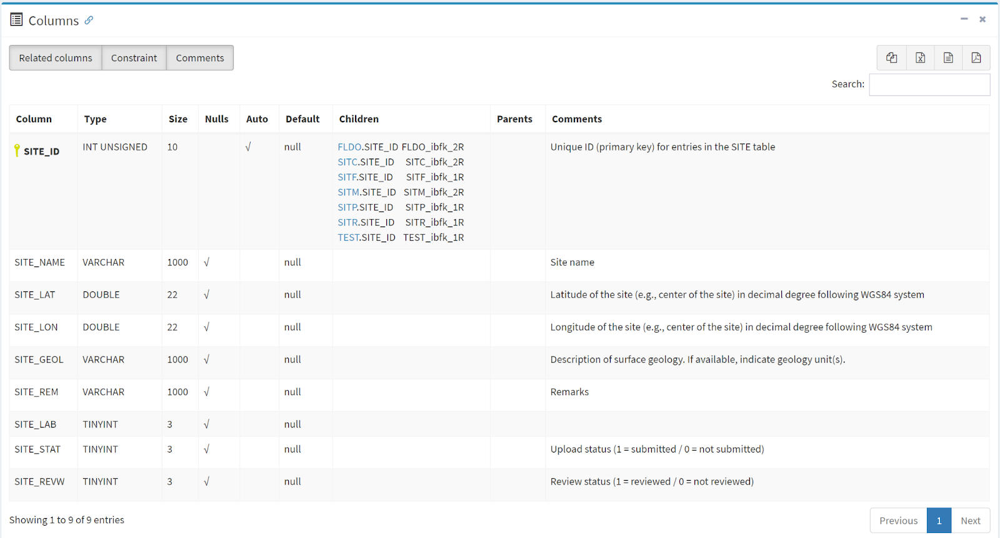

ngl_tools documentation
=======================

ngl_tools is a collection of Jupyter notebooks developed to interact with the NGL database in DesignSafe. 
The Next Generation Liquefaction (NGL) Project is advancing the state of the art in liquefaction research 
and working toward providing end users with a consensus approach to assess liquefaction potential within 
a probabilistic and risk-informed framework. Specifically, NGL’s goal is to first collect and organize 
liquefaction information in a common and comprehensive database to provide all researchers with a 
substantially larger, more consistent, and more reliable source of liquefaction data than existed previously. 
Based on this database, we will create probabilistic models that provide hazard- and risk-consistent bases 
for assessing liquefaction susceptibility, the potential for liquefaction to be triggered in susceptible soils, 
and the likely consequences. NGL is committed to an open and objective evaluation and integration of data, 
models and methods, as recommended in a 2016 National Academies .. _report: 
https://www.nap.edu/catalog/23474/state-of-the-art-and-practice-in-the-assessment-of-earthquake-induced-soil-liquefaction-and-its-consequences. 
The evaluation and integration of the data into new models and methods will be clear and transparent. Following these principles will ensure 
that the resulting liquefaction susceptibility, triggering, and consequence models are reliable, robust and 
vetted by the scientific community, providing a solid foundation for designing, constructing and overseeing 
critical infrastructure projects.

The NGL database is populated through a web GUI at www.nextgenerationliquefaction.org/. The web interface 
provides limited capabilities for users to interact with data. Users are able to view and download data, 
but they cannot use the GUI to develop an end-to-end workflow to make scientific inferences and draw conclusions 
from the data. To facilitate end-to-end workflows, the NGL database is replicated daily to .. _DesignSafe: https://www.designsafe-ci.org/, where 
users can interact with it using Jupyter notebooks. NGL Jupyter notebooks are published as projects accessible in
DesignSafe via the following DOI's:

https://doi.org/10.17603/ds2-xvp9-ag60 Sample Queries

https://doi.org/10.17603/ds2-99kp-rw11 Cone Penetration Test Viewer

https://doi.org/10.17603/ds2-cmn0-h864 Surface Wave Viewer

https://doi.org/10.17603/ds2-tq39-kp49 Invasive Geophysical Test Viewer

https://doi.org/10.17603/ds2-sj7t-av93 Boring Log Viewer

https://doi.org/10.17603/ds2-2xzy-1y96 Partner Dataset Overview

Importing the ngl_db package and connecting to the database
___________________________________________________________

Connecting to a relational database requires credentials, like username, password, database name, and hostname. 
Rather than requiring users to know these credentials, we have created a Python package that allows users to 
connect to the database. The lines of code below first imports the ngl_db Python package, and then creates a 
connection object to the database called cnx.

.. code-block:: python

    import ngl_db
    cnx = ngl_db.connect()
   

Understanding the database schema
_________________________________
The NGL database is organized into tables that are related to each other via keys. To query the database, 
you will need to understand the organizational structure of the database, called the schema. The database 
schema is documented at the following URL:

https://nextgenerationliquefaction.org/schema/index.html

Figure 1 describes the schema for the SITE table, which is a high level table in the NGL database where 
users enter information about a particular site they have investigated following an earthquake. The SITE 
table contains SITE_ID, which is the primary key for the SITE table. Every entry in the SITE table is assigned 
a unique SITE_ID that identifies the entry. Additional fields include SITE_NAME, SITE_LAT, SITE_LON, SITE_GEOL, 
SITE_REM, SITE_STAT, and SITE_REVW.  The Children column in Figure 1 identifies other tables in the NGL 
database that have been assigned a foreign key constraint to the SITE_ID field. For example, FLDO is a table 
containing field observations of liquefaction at a site. The FLDO table has a SITE_ID field, called a foreign 
key, that identifies the observation as being associated with the site with the same SITE_ID.

   
   Figure 1. Screenshot of NGL site table schema.

Packages
________
.. toctree::
   :maxdepth: 1
   
   connecting_to_database
   understanding_schema
   site_table_query
